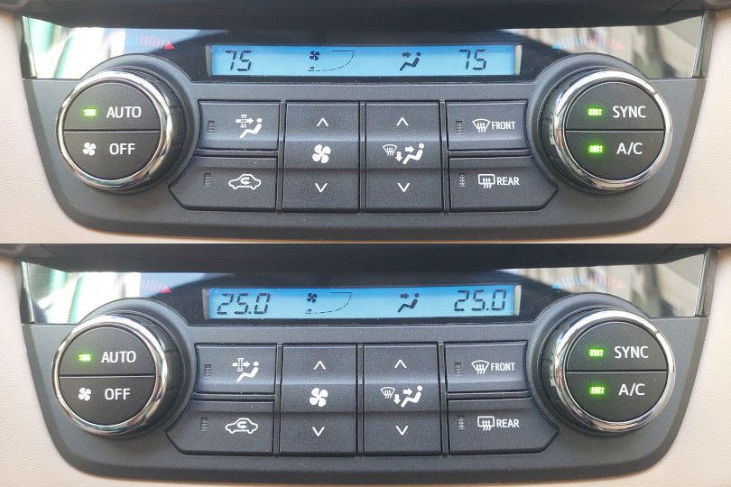
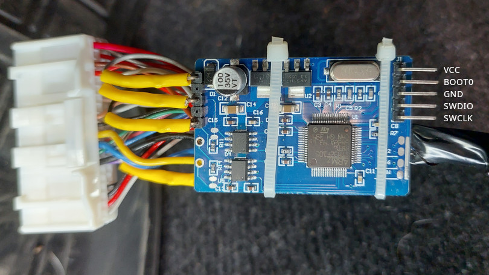
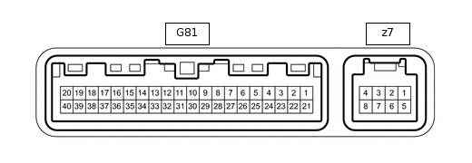
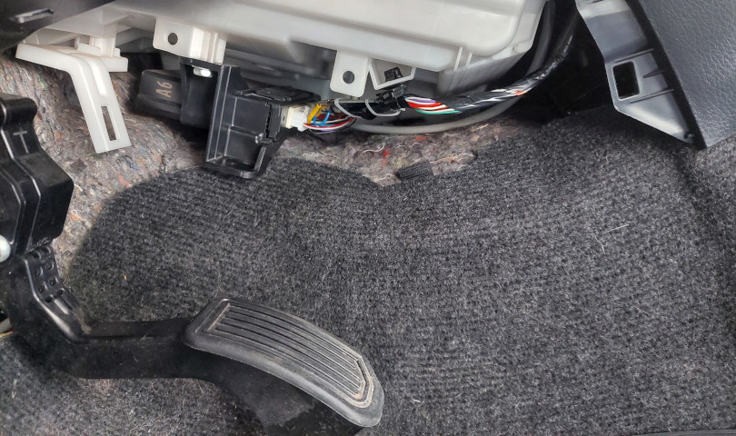

# Toyota Celsius Fix
[Русский](README.ru.md)
## What is this
A CAN filter that replaces those awful Fahrenheit units with proper Celsius temperatures in the climate control systems of US-market Toyotas. Unfortunately, Toyota never provided a built-in way to switch such a simple thing, so this ridiculous workaround became necessary.



## What you need
* A **BLUE** [mystery-purpose board](https://www.aliexpress.com/w/wholesale-can-filter.html) from AliExpress
* [ST-Link v2](https://www.aliexpress.com/w/wholesale-ST%2525252dLink-v2.html)
* Right-angle Dupont header pins

## How it works
The board is installed inline with the CAN bus between the climate control unit and the body ECU, and clears the 2nd byte in messages with ID **0x624**.

## Flashing the firmware



You need to solder header pins to the debug pads, connect the ST-Link, and flash the [firmware](https://github.com/kuznet1/toyota-celsius-fix/releases/download/v0.0.1/toyota-celsius-fix.bin).

The following connections are enough:
* **VCC**
* **GND**
* **SWDIO**
* **SWCLK**

For stability — both during flashing and in normal operation — I highly recommend connecting **BOOT0** to **GND** with a jumper. On my version of the board this pin was left floating, which caused random freezes.

### Linux/Windows

```bash
openocd -f interface/stlink.cfg -f target/stm32f1x.cfg -c "init; stm32f1x unlock 0; reset halt; program toyota-celsius-fix.bin 0x08000000 verify reset exit"
```

or using STM32CubeProgrammer:

```bash
STM32_Programmer_CLI -c port=SWD mode=UR -rdu -w toyota-celsius-fix.bin 0x08000000 -v -rst
```

### Installation
The filter is installed inline with the CAN bus. It filters traffic in both directions, so orientation does not matter.

The climate control module is located behind the trim panel to the right of the gas pedal. The pins and matching connector included with the board are actually compatible with the Toyota [connector](http://zatonevkredit.ru/repair_manuals/raw_content/ZslpaWQBDp6zoHmhsxmk), so the installation can be done without soldering anything inside the car.



| Pin    | Wire Color  | Description   |
|--------|-------------|---------------|
| G81-1  | Gray        | Power (ACC)   |
| G81-14 | Black/White | Ground (GND)  |
| G81-11 | Black       | CAN H bus     |
| G81-12 | White       | CAN L bus     |



### Credits
Thanks to [@andrewkabai](https://github.com/andrewkabai) for the detailed and thorough [research](https://dangerouspayload.com/2020/03/10/hacking-a-mileage-manipulator-can-bus-filter-device/) on these boards.